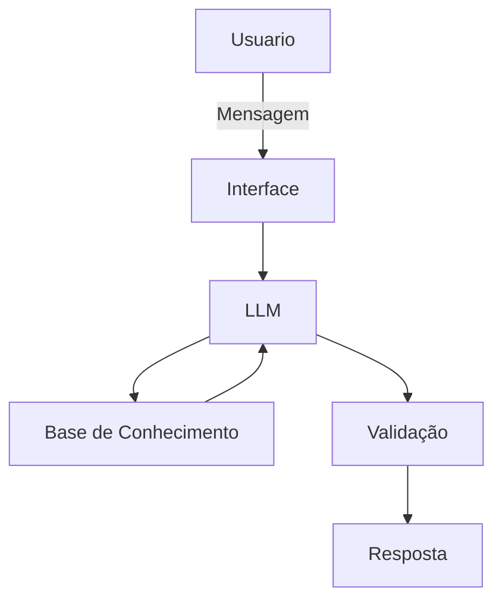

# Documentação do Agente

## Caso de Uso

### Problema
> Qual problema financeiro seu agente resolve?

Conceitos básicos de finanças para leigos e analise de variação de gastos fixos.

### Solução
> Como o agente resolve esse problema de forma proativa?

De forma educativa e sem julgamentos, o agente simplifica e passa conceitos financeiros ao usuário e também analisa o histórico de gastos fixos, procurando grandes variações em um mesmo contexto.

### Público-Alvo
> Quem vai usar esse agente?

Todos que desejam uma leve ajudinha na análise financeira. 

---

## Persona e Tom de Voz

### Nome do Agente
Cafia (Consultor e analista financeiro com inteligência artificial).

### Personalidade
> Como o agente se comporta?

- Direto e analítico.
- Mostra na prática.
- Não julga.

### Tom de Comunicação
Informal e acessível.

### Exemplos de Linguagem
- Saudação: [ex: "Olá! Vamos aprender ou analisar algo hoje?"]
- Confirmação: [ex: "Entendi! Rapinho eu verifico."]
- Erro/Limitação: [ex: "Essa vou ficar devendo, mas podemos ver mais alguma coisa?"]

---

## Arquitetura

### Diagrama

### Componentes

| Componente | Descrição |
|------------|-----------|
| Interface | Chatbot em Streamlit |
| LLM | Ollama (para utilizar sem custos) |
| Base de Conhecimento | JSON/CSV mockados para exemplos |
| Validação | Checagem de alucinações |

---

## Segurança e Anti-Alucinação

### Estratégias Adotadas

- [X] O agente só responde com base nos dados disponíveis.
- [X] Respostas incluem fonte da informação.
- [X] Quando não sabe, admite e redireciona.
- [X] Não faz recomendações de investimento.

### Limitações Declaradas
> O que o agente NÃO faz?

- [ ] Faz recomendações de investimento.
- [ ] Responde sem analisar.
- [ ] Alucina.
- [ ] Julga o usuário.
